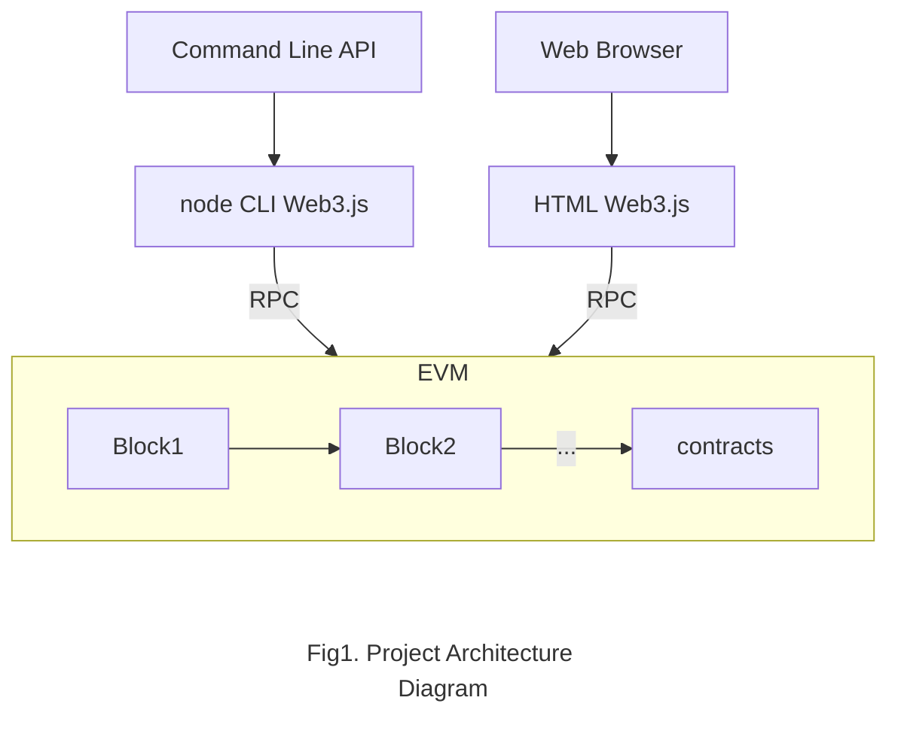

# distributed_ether_farm

## Game Concept
In this project, we’ll build a DAPP (decentralized application) game to combine the business simulation game with blockchain technology. In the game, each user owns farmland where a user can plant, grow and harvest crops. A user can add friends with another user and steal his/her friend's mature crops. Each crop is represented by a token and can be kept by the user after it's harvested. Users can trade the tokens they have with each other. 

## Outline of Game Play

The goal of the game is to become an experienced farmer and grow rare crops. We will go through the game process in detail and describe functionality that the game allows for the user.  A user in the game maintains farmland, represented by a 3 by 3 grid, and an initial amount of money. With the initial money, each user could buy various kinds of crop seeds, ranging from corn, rice to wheat. A user can put a seed per cell on the grid, and need to water them on time. After a predefined time which represents the growth cycle of a crop, the crop matures and the user can harvest them. In this phase, a user’s friend could steal mature crops if they are not harvested by the user. After harvesting, a user gains experience and when the experience reaches the limit to the next level. The system unlocks a new set of crop seeds for the user. A user can store the harvested crops and sell the crops for money so that they could buy seeds later. 
In this game, a crop is represented by a token and can be saved in the user's account permanently. In addition to business managing the game itself, the game supports a marketplace for users to exchange harvested crop tokens with each other. 
In summary, a user can 
Markup : * Buy seeds
         * Grow crops
         * Steal friends’ mature crops
         * Sell crops 
         * Exchange crop token on the market

This project involves environment setup, smart contract development and frontend development.

The basic technique we would implement can be summarized as follows:

1. We would setup an environment to simulate a chain. We will use remix on local full node to test our smart contract with web3.js and frontend.
2. We would implement some token based game items, and implement some basic game interactions, such as items exchange, harvesting items, friend invitation, stealing items etc.
3. We would write a frontend to interact with the smart contract. We will use Truffle framework to build the draft frontend of the game.

## Development

The target game platform is Browser that based on Chromium. The development tools are: Remix, Truffle, web3.js, ganache, Node.js, Solidity.

We will test our program on virtual machines. Group member who use Mac OS X and Windows 10 will use VMware Fusion and VMWare workstation to run Linux, and setup a Remix node in the virtual machine. 

We will mainly perform gameplay test to evaluate the decentralized video game that we develop. We will prepare a test plan with a set of delicated tests to evaluate all features in the game. For instance, the time taken to grow crops will be reduced to a few seconds during the evaluation, so that the harvest operation can be evaluated within a short amount of time. The front end display will be evaluated by manually checking whether there is some display issues. We will also use some third-party or self-implemented tools to check if the blocks are attached to the chain properly.

Since our plan is to setup a private environment for the game instead of uploading it to the public chain, we may not be able to perform a load test. We will still evaluate the game by having multiple players to play at the same time.

## Timelines
We plan to split the development into two main parts: frontend and backend. We will spend about 3 days to design the interface that the frontend uses to communicate with the backend. And then, in the next 2 weeks, one member will work on the frontend, and the other two members will work on the backend. The next 2 to 3 days will be used for integration and basic testing, and the rest of the time will be spent for evaluation.
